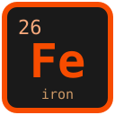

# elements



**The periodic table in your terminal, with the full Wikipedia article for every element. Written in Rust.**

   

Interactive periodic table: all 118 confirmed elements plus the hypothesized 119–126. Move around the category-colored 18-group layout and read each element's structured properties and complete Wikipedia article in the pane below — entirely offline. Built on [Crust](https://github.com/isene/crust), part of the [Fe2O3 suite](https://github.com/isene/fe2o3).

## Features

- **Full table**: 118 confirmed elements, plus hypothesized 119–126 (period 8 and the predicted g-block row)
- **Twelve color modes** (keys 1-9, `m` for the menu, or Ctrl+←/→ to cycle): category, phase at STP, cosmic origin (Big Bang, dying stars, supernovae, neutron-star mergers …), occurrence, block, electronegativity, melting point, density, phase at an adjustable temperature, first ionization energy, role in biology, and stable vs no-stable-isotope — legend in the header bar
- **The temperature instrument**: in mode 9, `+`/`-` move the temperature (±25 K, or ±250 K with `*`/`_`) and the table melts and boils as you climb. Mercury goes liquid at 234 K, the alkali metals boil away before 1000 K
- **Group and period labels** on the table; math markup and reference/link tail sections stripped from the articles
- **Wide-terminal layout**: on terminals ≥151 columns the property table sits beside the periodic table, leaving the pane below for the article
- **Structured data**: mass, density, melt/boil (K and °C), molar heat, group/period/block, shells, electron configuration, electronegativity, electron affinity, ionization energy, appearance, discoverer and year of discovery (Wikidata)
- **Ask Claude** (`c`): a conversation about the element you're looking at, with its data and article as context; follow-ups keep the thread
- **The complete Wikipedia article** for every element, scrollable in the detail pane
- **Offline**: one-time fetch, cached at `~/.elements/elements.json` (~4 MB); the UI never touches the network
- **Scriptable**: `elements tungsten | less` prints plain text when piped
- **Zero idle cost**: event-driven, no timers, no polling
- **Instant**: starts in under 20 ms, cache included

## Install

Download the prebuilt binary from [Releases](https://github.com/isene/elements/releases), or build from source:

```bash
cargo build --release
cp target/release/elements ~/.local/bin/
```

First start fetches the dataset from Wikipedia (about a minute), then everything is local.

## Key Bindings

| Key | Action |
|-----|--------|
| ← →, h/l | Previous / next element by atomic number (walks the whole table, row to row) |
| ↑ ↓, k/j | Up / down within the column |
| < > | Same as ← → |
| 1-9, Ctrl+←/→ | Color mode (see the list above) |
| m | Mode menu, including the modes past the digits |
| + - (* _) | Temperature ±25 K (±250 K) while in the "phase at T" mode |
| J K, Shift+↓/↑ | Scroll the article one line |
| Space, PgUp/PgDn | Scroll the article one page |
| g G | Top / bottom of the article |
| / | Find an element (name, symbol, or atomic number) |
| c | Ask Claude about this element (follow-ups keep context) |
| C | Toggle the Claude conversation view |
| w | Open the element's Wikipedia page in the browser |
| u | Re-fetch all data from Wikipedia |
| ? | Help |
| ESC | Back to the article (quits from the article view) |
| q | Quit |

## CLI

```
elements [ELEMENT] [--fetch]
```

`ELEMENT` starts at (or, when piped, prints) that element — by name, symbol, or atomic number. `--fetch` rebuilds the local dataset.

## Data

Structured properties come from the Wikipedia-derived [Periodic-Table-JSON](https://github.com/Bowserinator/Periodic-Table-JSON) dataset; each element also carries its full Wikipedia article via the TextExtracts API. The article texts are CC BY-SA (Wikipedia); the code is public domain.

## License

Public domain (Unlicense). Created by [Geir Isene](https://isene.com).
